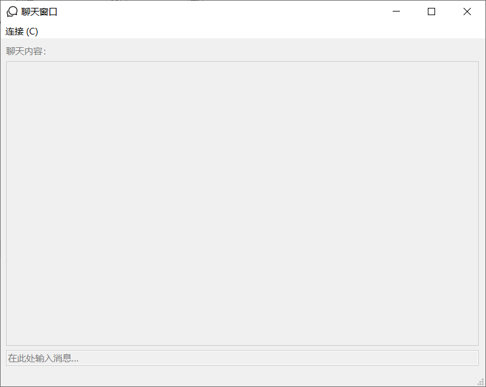
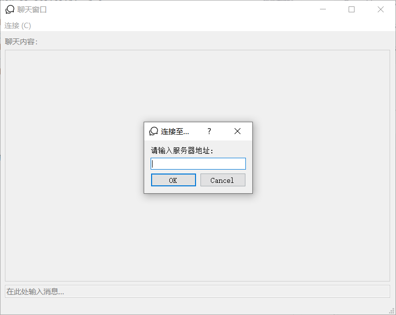
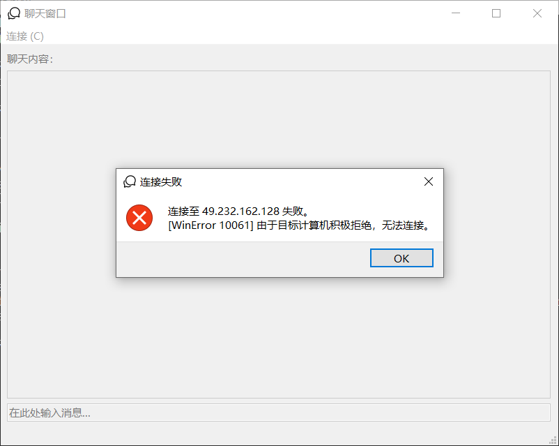
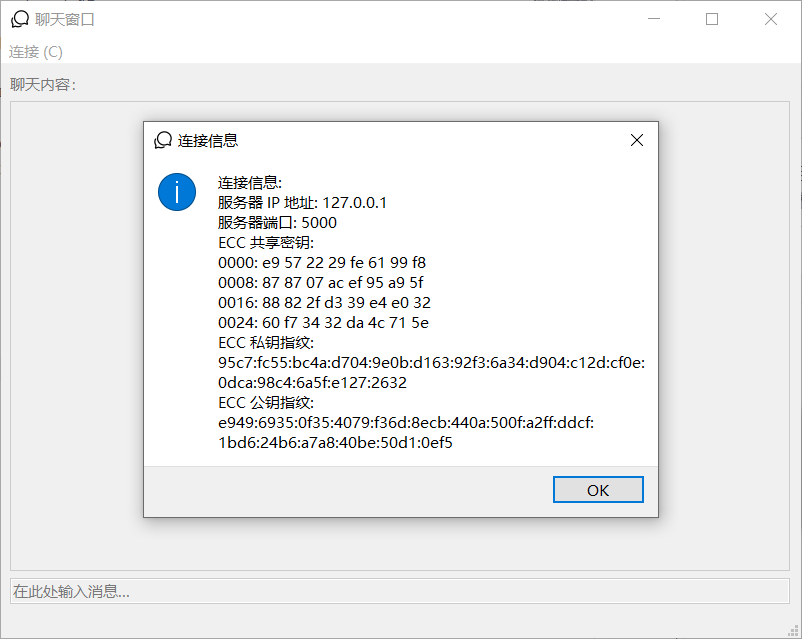
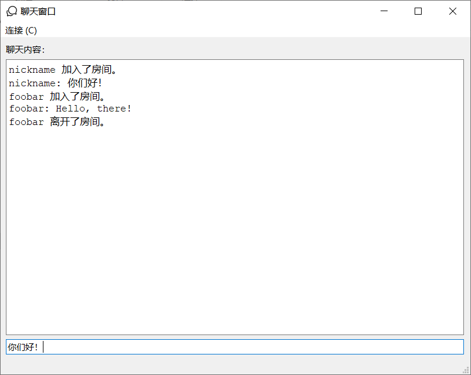

# 加密聊天室 文档

Github 代码库: https://github.com/origamizyt/SecuredRoom

## 1. 安装

使用 Git 克隆代码库即可完成安装：
```
$ git clone https://github.com/origamizyt/SecuredRoom.git 
```

克隆后，运行 `install_dependencies.py` 以安装依赖：
```
$ python install_dependencies.py
```

## 2. 使用

### 2.1 服务端

运行 `sr_server.py` 以启动服务器：
```
$ python sr_server.py
[MainThread:INFO] 正在启动服务器...
[ServerDaemon:INFO] 使用配置: MinBetween=1, MaxMessageLength=255, BacklogSize=5
[ServerDaemon:INFO] 正在监听 0.0.0.0 端口 5000
```

按下 Ctrl+C 以停止服务器。服务器程序接受几个可选的命令行开关，分别为：

- `-b` 或 `--between` 指定客户端发送消息的最小间隔时间。该时间以秒计算，为浮点型。指定 0 或负数则没有间隔限制。默认为 1.0。
- `-m` 或 `--msglen` 指定客户端发送消息的最大长度，以 Unicode 字符计。必须为整型。请勿指定 0 或负数。默认为 0xFF (255)。
- `-g` 或 `--backlog` 指定服务器后台连接队列的最大长度。通常不需要指定该参数。必须为整型。请勿指定 0 或负数。默认为 5。
- `-q` 或 `--quiet` 指定服务器是否处于静默模式。处于静默模式时，所有日志都会被关闭。无需指定参数。

示例：
```
# 客户端发送消息间隔 3 秒：
$ python sr_server.py -b 3
# 客户端可以发送 1000 字的消息：
$ python sr_server.py --msglen 1000
# 静默模式：
$ python sr_server.py -q
# 组合：
$ python sr_server.py -g 10 --quiet --between 0
```

### 2.2 客户端

运行 `sr_client.pyw` 以启动客户端。启动后，应该可以看到如下窗口：



选择 "连接 > 连接至..." 菜单项以连接至服务器。在弹出的输入框中输入服务器 IP 地址：



单击 "OK"。若连接成功则应该可以在底部的状态栏中看到提示信息。若连接失败则会弹出消息框提示您：



连接成功后，检查服务端应该能看到类似如下的 ECC 握手信息：
```
[ServerDaemon:INFO] 客户端 127.0.0.1:50636 已连接
[Session-127.0.0.1:50636:INFO] 密钥协商完毕。共享密钥如下:
0000: e9 57 22 29 fe 61 99 f8
0008: 87 87 07 ac ef 95 a9 5f
0016: 88 82 2f d3 39 e4 e0 32
0024: 60 f7 34 32 da 4c 71 5e
```

选择 "连接 > 连接信息..." 菜单项，应该能看到类似如下的连接信息：



选择 "连接 > 加入房间..." 菜单项以加入聊天室。在弹出的输入框中输入昵称与房间名即可加入指定的房间。值得注意的是，如果指定房间内有相同昵称的成员则无法加入房间。

若加入成功，则在中央的文本框中应会显示 "XXX 加入了房间"。若加入失败则底部的状态栏会提示您。加入房间后，您可以通过下方的文本条及回车键发送信息：



若发送信息过于频繁，底部的状态栏会提示您发送失败。关闭聊天窗口或重新选择房间即可退出房间。